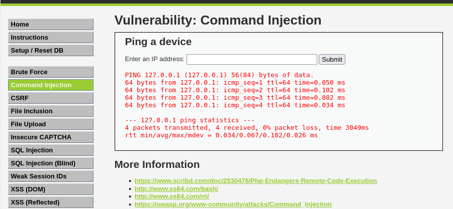
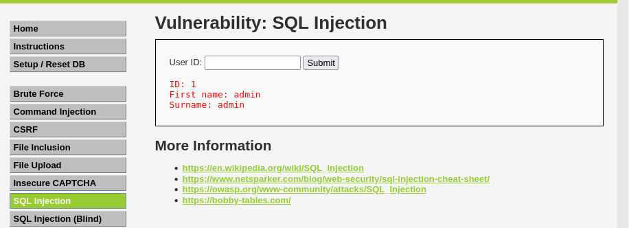

# Enterprise Web Application Security Assessment - DVWA

This repository contains the comprehensive, black-box penetration testing report and validated Proof-of-Concept (PoC) artifacts for a security assessment conducted against the **Damn Vulnerable Web Application (DVWA)**. The assessment strictly adhered to the industry-standard **OWASP Web Security Testing Guide (WSTG)** framework.

---

## 📋 Executive Summary

A structural security evaluation of the target application revealed critical-severity flaws, including **Remote Code Execution (RCE)** and **SQL Injection resulting in credential disclosure**. These issues could allow complete compromise of the underlying system and unauthorized data extraction. Immediate code-level remediation is detailed below to improve the security posture of the deployment.

---

## 🛠️ Tech Stack & Lab Environment

* **Target Application:** Damn Vulnerable Web Application (DVWA)
* **Base OS:** Debian Linux / Kali Linux
* **Web Server:** Apache HTTP Server v2.4.63
* **Database Engine:** MariaDB v11.4.5
* **Primary Tools:** `Nmap`, `Nikto`, `FFUF`, `WhatWeb`, `Burp Suite Professional`

---

## 🔍 Methodology (OWASP WSTG)

The assessment followed a highly organized five-stage security evaluation lifecycle:

1. **Reconnaissance:** Footprinting server signatures, open ports, and active web properties.
2. **Attack Surface Mapping:** Enumerating hidden administrative endpoints and exposed source control configurations.
3. **Vulnerability Assessment:** Identifying misconfigurations, missing security headers, and operational flaws.
4. **Exploitation:** Executing structured manual exploits to validate risk impact on the backend.
5. **Reporting & Remediation:** Documenting technical findings and implementing programmatic patches.

---

## 🚀 Validated Vulnerabilities & Proof-of-Concept

### 1. Remote Code Execution (RCE) via OS Command Injection

* **Endpoint:** `/vulnerabilities/exec/`
* **Vulnerability:** Lack of input sanitization allowed arbitrary system shell command injection.
* **Exploit Payload:** `127.0.0.1 && whoami`
* **Impact:** Commands were executed under the privilege context of the web server (`www-data`), indicating the potential for complete host compromise.

#### Baseline Test



#### Exploitation Proof


---

### 2. Database Credential Disclosure via SQL Injection

* **Endpoint:** `/vulnerabilities/sqli/`
* **Vulnerability:** Unparameterized input parameters were passed directly into the SQL interpreter.
* **Exploit Payload:** `1' UNION SELECT user, password FROM users#`
* **Impact:** Unauthenticated retrieval of administrative credentials, including user records and password hashes.

#### Baseline Test



#### Exploitation Proof


---

## 🛡️ Remediation Overview

### OS Command Injection Fix (PHP)

Avoid raw execution wrappers and implement strong input validation on dynamic parameters:

```php
$target = $_POST['ip'];

if (filter_var($target, FILTER_VALIDATE_IP)) {
    $cmd = shell_exec("ping -c 4 " . escapeshellarg($target));
    echo "<pre>{$cmd}</pre>";
} else {
    echo "Error: Invalid IP Address format.";
}
```

### SQL Injection Fix (PDO Prepared Statements)

Bind variables securely using parameterized SQL statements:

```php
$id = $_GET['id'];

$stmt = $pdo->prepare(
    'SELECT first_name, last_name 
     FROM users 
     WHERE user_id = :id'
);

$stmt->execute(['id' => $id]);

$user = $stmt->fetch();
```

---

## 📦 Reconnaissance and Mapping Footprints

### Technology Footprinting (WhatWeb)

Using **WhatWeb** to fingerprint active server signatures and web technologies.

### Network Port Profiling (Nmap)

Utilizing **Nmap** to scan open ports, identify service versions, and perform operating system detection.

### Automated Vulnerability Identification (Nikto)

Running automated vulnerability scans to identify server misconfigurations and potentially outdated server components.

### Passive Directory Discovery

Searching publicly accessible directories and mapping exposed assets without direct active interactions.

### Directory Fuzzing (FFUF)

Using **FFUF (Fuzz Faster U Fool)** to enumerate hidden endpoints, directories, and files.

---

## 💻 Environment Setup & Manual Proxy Testing

### Lab Services Initialization

Setting up the virtual networking environment and starting the required local services.

### Target Environment Configuration

Configuring DVWA security levels and validating system connectivity.

### Manual Proxy Analysis (Burp Suite)

Routing browser traffic through **Burp Suite Professional** to capture, analyze, and manipulate HTTP requests.

---

## 🔗 Credentials & Contact

* **Name:** Irsa Attique
* **Academic Background:** BS Cyber Security, COMSATS University Islamabad
* **Affiliation:** Dev ShieldX (Internship Capstone Project)
